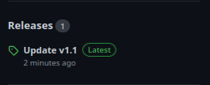

## Hello everybody!
Your goal in this game is - to act as a shield, a planet from the owners of meteorites flying in it.

You need to move with the buttons: W, S or Up and Down buttons.

## How download game?
- Step 1: Find tab "Release" on this page.
 

- Step 2: Click to latest release.
- Step 3: Click to "Assets".
 
 
- Step 4: In opened page, select your os.
- Step 5: Download a .zip file

- Step 6: Unpack the downloaded .zip file
- Step 7: Start the .exe (Windows) or .x86_64 (Linux) file.

Good Game!
